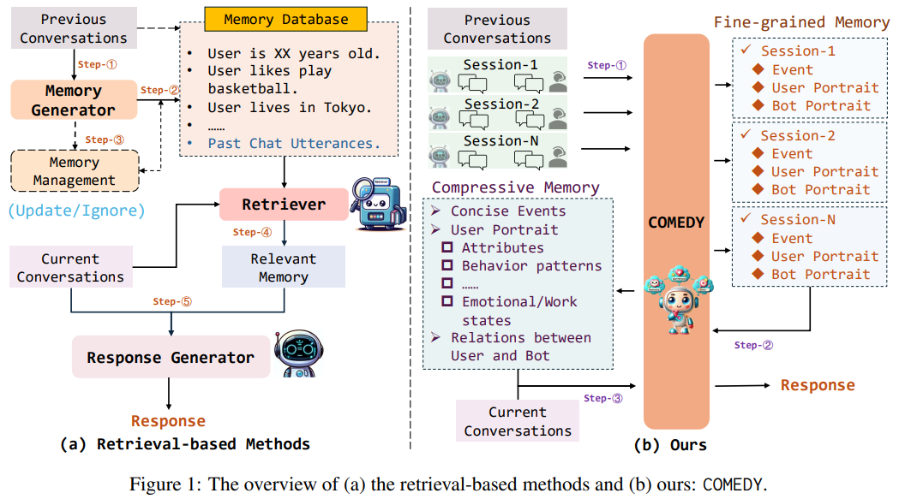
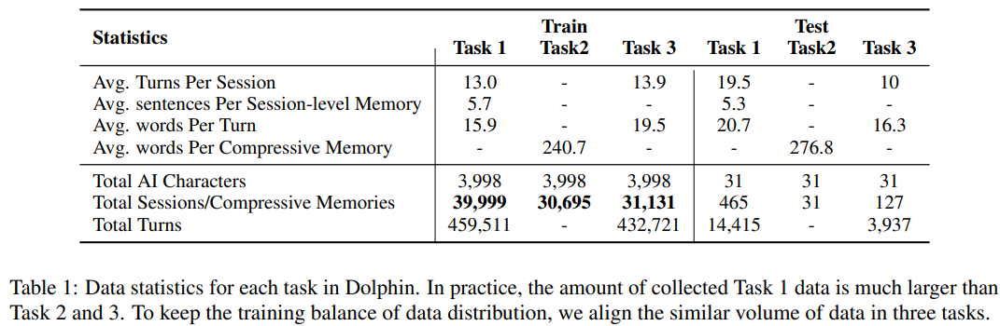
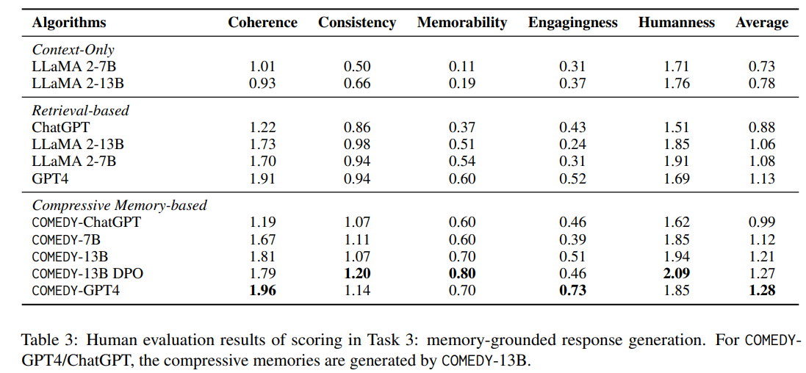
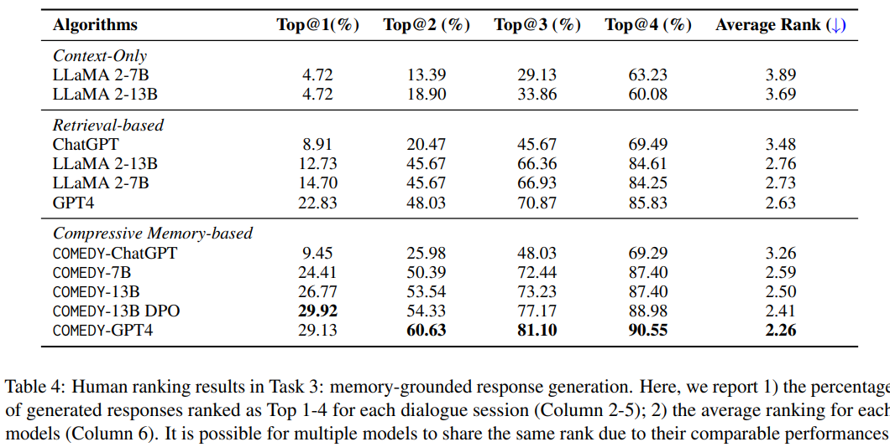

# COMEDY
This is the official project of paper: [**Compress to Impress: Unleashing the Potential of Compressive Memory in Real-World Long-Term Conversations**](https://arxiv.org/abs/2402.11975)

<br>
<div align="center">
  
</div>

  

# Overview

This repository contains resources for accessing the official benchmarks, codes, and checkpoints of the paper: "[**Compress to Impress: Unleashing the Potential of Compressive Memory in Real-World Long-Term Conversations**](https://arxiv.org/abs/2402.11975)".


This work pioneers exploring and building powerful Long-Term Conversation Dialogue Systems without ***retrieval***. To accomplish this, we make the following works:

- **COMEDY**, LLM-based **CO**mpressive **M**emory-**E**nhanced **D**ialogue  s**Y**stems framework.
- **Dolphin**, the biggest Chinese long-term conversation  dataset from actual online user-chatbot interactions. This dataset contains three tasks: **Session-Level Memory Summarization**; **Memory Compression**; **Memory-Grounded Response Generation**, comprising an extensive collection of 100k samples.


## COMEDY VS. Retrieval-based Approaches



COMEDY adopts a groundbreaking ''**One-for-All**'' approach, utilizing a single, unified model to manage the entire process from memory generation, compression to final response generation for long-term memory dialogue generation.


 - COMEDY firstly involves distilling session-specific memory from past dialogues, encompassing fine-grained session summaries, including event recaps, and detailed user and bot portraits; 
 
 - In a break from traditional systems, COMEDY eschews the use of a memory database for storing these insights. Instead, it reprocesses and condenses memories from all past interactions, forming a *Compressive Memory*. The first part is the **concise events** that have occurred throughout all the conversations, creating a historical narrative that the system can draw upon. The second and third parts consist of a **detailed user profile** and the **dynamic relationship changes** between the user and chatbot across sessions, both derived from past conversational events.

- Finally, COMEDY skillfully integrates this compressive memory into ongoing conversations, enabling contextually memory-enhanced interactions.


### 🤗Datasets 

Our collected Dpolphin contain 3 tasks:

- **Task1: Session-Level Memory Summarization**
- **Task2: Memory Compression**
- **Task3: Memory-Grounded Response Generation**




## Usage & Download


🤗 [**Dolphin-train Dataset**](https://huggingface.co/Nuo97)

🤗 [**Dolphin-DPO Dataset**](https://huggingface.co/datasets/Nuo97/Dolphin-DPO)

🤗 [**Dolphin-Test Dataset**]

🤗 [**COMEDY-7B**](https://huggingface.co/Nuo97/COMEDY_7B)

🤗 [**COMEDY-13B-DPO**](https://huggingface.co/Nuo97/COMEDY_13B_DPO)


<!--

🤗 [**Dolphin-train Dataset**]()

🤗 [**Dolphin-DPO Dataset**](https://huggingface.co/datasets/Nuo97/Dolphin-DPO)

🤗 [**Dolphin-Test Dataset**]()

-->


## **Table of Contents**

- [ℹ Introduction](#introduction)
- [⚙️ Installation](#installation)
- [🛠️ Training and Inference](#training-and-inference)
- [📜 License](#license)
- [📖 Citation](#citation)

## **Introduction**
This work introduces a novel framework, COmpressive Memory-Enhanced Dialogue sYstems (COMEDY), which eschews traditional retrieval modules and memory databases. Instead, COMEDY adopts a "One-for-All" approach, utilizing a single language model to manage
memory generation, compression, and response generation.

## **Installation**

Clone this repository and install the required packages:

```bash
git clone https://github.com/nuochenpku/COMEDY.git
cd COMEDY
pip install -r requirements.txt
```

## **Training and Inference**

Our training strategies include two stage: **Mixed-task training** and **DPO Alignment**


### **Data Loading**

Run the following command to preprocess the data, like:

```python
from datasets import load_dataset

dataset = load_dataset("Nuo97/Dolphin-DPO")
```

### **Quick Start**
To play with our model, run:

```python
# Use a pipeline as a high-level helper
from transformers import pipeline

pipe = pipeline("text-generation", model="Nuo97/COMEDY_7B")

input = string()
output = pipeline(input)[0]['generated_text']
print(output)
```

### **Step1: Mix-Tasked Training**


```bash
bash run_step1.13B.sh
```

which consists of the following commands:


```bash

#!/bin/bash

# DeepSpeed Team

CURRENT_TIME=$(TZ=UTC-8 date +"%Y-%m-%d-%H.%M.%S")

ZERO_STAGE="--zero_stage 2"

MODEL_PATH=$1
OUTPUT=$2
LOG_PATH=$3

export TOKENIZERS_PARALLELISM=False
# export CUDA_VISIBLE_DEVICES="0,1,2,3,4,5,6,7"

# Reminder to shuffle train data in advance!
TRN_FN=$4
DEV_FN=$5

TOTAL_SIZE=`wc -l ${TRN_FN}`
echo "number of samples in trainset: ${TOTAL_SIZE}"

mkdir -p $OUTPUT/$CURRENT_TIME
deepspeed --include localhost:0,1,2,3,4,5,6,7 \
--master_port 12390 \
training/step1_supervised_finetuning/main.py \
   --model_name_or_path ${MODEL_PATH} \
   --train_data_path ${TRN_FN} \
   --valid_data_path ${DEV_FN} \
   --per_device_train_batch_size 4 \
   --per_device_eval_batch_size 4 \
   --data_output_path $OUTPUT/data \
   --max_seq_len 2048 \
   --learning_rate 1e-5  \
   --weight_decay 0.1 \
   --num_train_epochs 3 \
   --num_train_samples ${TOTAL_SIZE} \
   --gradient_accumulation_steps 1 \
   --lr_scheduler_type cosine \
   --num_warmup_steps 400 \
   --seed 42 \
   ${ZERO_STAGE} \
   --save_interval 2000 \
   --log_interval 100 \
   --eval_interval 1000 \
   --output_dir $OUTPUT/$CURRENT_TIME \
   --gradient_checkpointing \
   --tensorboard_path $LOG_PATH \
   &>$OUTPUT/train.log&

```


### **Step2： DPO Alignment**


```bash
cd training/step2_dpo_training
bash training_scripts/single_node/run_memory.sh
```

```bash
#!/bin/bash
# Copyright (c) Microsoft Corporation.
# SPDX-License-Identifier: Apache-2.0
# local/xjsonfile/rftV2
# DeepSpeed Team
OUTPUT=$1
ZERO_STAGE=$2
DATA_PATH=$3
SFT_CKPT=$4

if [ "$OUTPUT" == "" ]; then
    OUTPUT=output/compress_memory/13b_v2_dpo_0.01_sft/
fi
if [ "$ZERO_STAGE" == "" ]; then
    ZERO_STAGE=3
fi
mkdir -p $OUTPUT

deepspeed --include localhost:0,1,2,3,4,5,6,7 --master_port=29592 main.py  \
   --data_path $DATA_PATH \
   --data_split 0,10,0 \
   --model_name_or_path $SFT_CKPT \
   --per_device_train_batch_size 1 \
   --per_device_eval_batch_size 2 \
   --max_seq_len 2048 \
   --learning_rate 1e-5  \
   --weight_decay 0. \
   --num_train_epochs 2  \
   --beta 0.01 \
   --gradient_accumulation_steps 1 \
   --lr_scheduler_type cosine \
   --num_warmup_steps 10 \
   --seed 1234 \
   --zero_stage $ZERO_STAGE \
   --deepspeed \
   --add_sft \
   --print_loss \
   --gradient_checkpointing \
   --output_dir $OUTPUT \
   --tensorboard_path $OUTPUT/runs \
   &> $OUTPUT/training.log 

```


### **Generation**

To replicate the experimental results in our paper, run:

```bash
python comedy_test.py
```


## **Results**

We recruit human annotators to evaluate the model performances in terms of **Scoring** and **Ranking**.

### **Overall Results on Human Scoring**



### **Overall Results on Human Ranking**




## **Citation**

Please cite our paper if you use our data, model or code. Please also kindly cite the original dataset papers. 

```
@misc{chen2024compress,
      title={Compress to Impress: Unleashing the Potential of Compressive Memory in Real-World Long-Term Conversations}, 
      author={Nuo Chen and Hongguang Li and Juhua Huang and Baoyuan Wang and Jia Li},
      year={2024},
      eprint={2402.11975},
      archivePrefix={arXiv},
      primaryClass={cs.CL}
}
```


